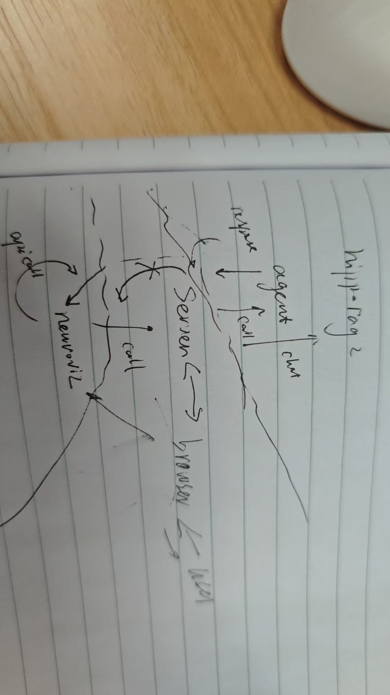

# multi-agent-framework

Part of the [ProjAtlas](../) code repository. Implements the multi-agent framework behind
ProjAtlas's conversational assistant (see paper Methods: "Multi-agent framework"):

- **Paper interpretation agent** — RAG-grounded literature Q&A over a curated neuroscience
  corpus (see [`../rag-evaluation`](../rag-evaluation) for the corresponding benchmark and
  evaluation).
- **Neuron selection agent** and **brain visualization agent** — translate natural-language
  instructions into structured function calls via a fine-tuned model (see
  [`../function-calling`](../function-calling) for training and evaluation).
- **Textual summarization agent** — generates natural-language reports from quantitative
  analyses of selected neurons (soma distribution, projection overview, and axon
  length-/terminal count-weighted projection heatmaps).

## Python

- Python 3.10

## Dependencies

- [HippoRAG](https://github.com/OSU-NLP-Group/HippoRAG) (MIT License)
- openai

## Setup

```bash
pip install -r requirements.txt
cp .env.example .env
# Edit .env with your OpenAI-compatible endpoint, API key, and model names
```

`FUNCTION_CALLING_MODEL` in `.env` points to the fine-tuned model used by the neuron
selection and brain visualization agents. This model must be deployed separately (e.g.
via vLLM) and reachable at the endpoint configured by `BASE_URL`/`API_KEY`. The model
weights and deployment instructions are in
[`../function-calling/README.md`](../function-calling/README.md#fine-tuned-model-weights).

## Data

The paper interpretation agent's RAG knowledge base is built from:

1. Neuroscience publications, converted to Markdown (e.g. with [marker](https://github.com/VikParuchuri/marker))
   — see [`../rag-evaluation/data/SOURCE_PAPERS.md`](../rag-evaluation/data/SOURCE_PAPERS.md)
   for the paper list and [`data/RAG-md-mouse/README.md`](data/RAG-md-mouse/README.md) /
   [`data/RAG-md-macaque/README.md`](data/RAG-md-macaque/README.md) for where to place them.
   Full text is not redistributed in this repository due to publisher copyright.
2. `data/RAG-md-docs/` — the ProjAtlas platform's own user guide (included in full).
3. An offline HippoRAG index built from the above (generated locally, not tracked in git;
   see `.gitignore`).

## Architecture



## Citation

See the [repository root README](../README.md#citation) for the current citation.
